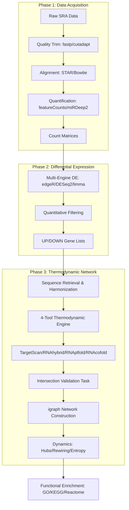

<p align="center">
  
</p>

<p align="center">
  
  
  
</p>

---

<div align="center">
  <h2>⚡ IS_mi-mrna_thermo_validation_network ⚡</h2>
  <sub>Validation of known miRNA–mRNA regulatory states in Ischemic Stroke via thermodynamic stability, seed duplex formation, and structural accessibility filtering.</sub>
</div>

---

## 📋 Research Methodology Reference
This repository contains the **computational engineering skeleton** developed for a dissertation study on **Ischemic Stroke regulatory dynamics**. 

> [!IMPORTANT]
> **Methodological Reference:** To protect ongoing biological discoveries and proprietary findings, specific biological thresholds and filtering constants have been masked (e.g., [THRESHOLD_MFE]). However, the **operational logic**, **infrastructure**, and **file-handling architectures** are fully preserved as a technical showcase.

---

## 📁 Pipeline Architecture (Mermaid)



---

## 📁 Repository Structure

```text
IS_mi-mrna_thermo_validation_network/
│
├── phase1_data_acquisition/          ← Raw data ingest (FASTQ → count matrices)
├── phase2_differential_expression/   ← Multi-engine DE analysis (edgeR, DESeq2, limma)
├── phase3_thermodynamic_network/     ← Thermodynamic validation + network analysis
├── orchestration/                    ← Master pipeline launcher (run_all_phases.sh)
├── examples/                         ← Synthetic data for demonstration
└── README.md
```

- [`phase1_data_acquisition/`](./phase1_data_acquisition/) — SRA tools, STAR, and miRDeep2 quantification workflows.
- [`phase2_differential_expression/`](./phase2_differential_expression/) — Robust multi-platform DE framework for RNA-seq and Microarray.
- [`phase3_thermodynamic_network/`](./phase3_thermodynamic_network/) — The core thermodynamic engine integrating 4 sequence-structure tools.

---

## 💡 Why Thermodynamic Validation?

This framework solves the **"Target Specificity Problem"** in miRNA analysis by moving beyond simple seed matches. By intersecting four structural tools—TargetScan, RNAhybrid, RNAplfold, and RNAcofold—it captures the **regulatory entropy loss** occurring during the transition from healthy to ischemic states.

### Key Contributions
| Feature | Detail |
|---------|--------|
| **Multi-engine DE** | edgeR (miRNA-seq) · DESeq2 (RNA-seq) · limma (microarray) |
| **4-tool thermodynamics** | RNAhybrid (MFE ≤ [THRESHOLD_MFE]) · RNAplfold · RNAcofold · TargetScan |
| **Cross-species validation** | Human (hsa) + Rat (rno) parallel networks |
| **Network rigidity metric** | Degree rewiring quantification across progression states |
| **Regulatory flip detection** | miRNAs switching binding affinity class across states |

---

## 🛠️ Technologies & Research Arsenal


---

## 📜 Intellectual Property & Legal Notice

- **Research Status:** Manuscript in Communication / Proprietary Clinical Methodology.
- **OWNER:** **Vidit Zainith ([@VampZie](https://github.com/VampZie))** served as the **Principal Computational Architect and Bug-Resolution Lead** for the implementation and optimization of these multi-omics modules.
- **Portfolio Disclaimer:** This repository is curated exclusively for **Professional Portfolio Demonstration**. The methodologies, skeleton-logics, and algorithmic architectures represent prioritized research assets of the owner **Vidit Zainith ([@VampZie](https://github.com/VampZie))**.
- **Legal Enforcement:** Unauthorized replication, commercial redistribution, or derivative utilization of the proprietary logic structures contained herein without explicit written authorization is strictly prohibited. Any infringement of Intellectual Property Rights (IPR) will be addressed through formal legal channels in accordance with international copyright and academic integrity laws.
- **Temporal Attribution (Prior Art):** This repository was published and archived on this platform as of **April 21, 2026**. This timestamp serves as public, immutable evidence of methodological authorship and prior art for all internal architectures displayed.

---

<div align="center">
  
</div>

---

<p align="center">
  
</p>
